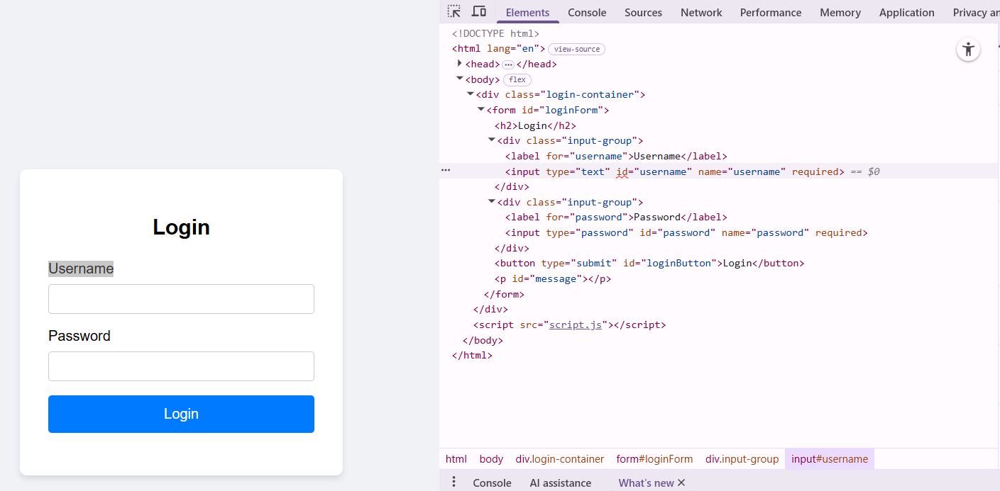
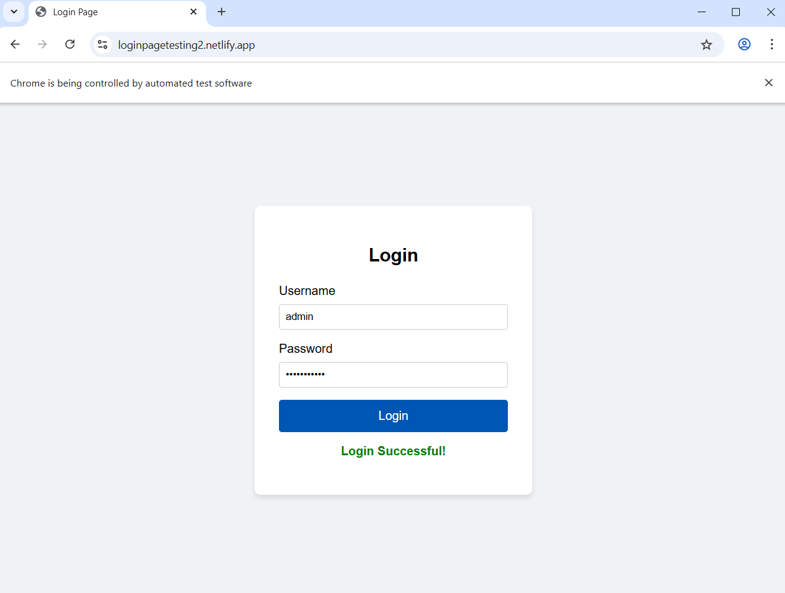

# Selenium Login Test (Python)

This script uses Selenium to automatically test a login page.

## Requirements
- Python
- Selenium
- Chrome browser
- ChromeDriver (or Selenium Manager)

Install Selenium:
```bash
pip install selenium
```
```bash
pip install webdriver-manager
```

App Link : https://loginpagetesting2.netlify.app/

Simple Login Page:



Test Script:
```bash
from selenium import webdriver
from selenium.webdriver.common.by import By
import time

driver = webdriver.Chrome()   

driver.get("https://loginpagetesting2.netlify.app/")

username = driver.find_element(By.ID, "username")
password = driver.find_element(By.ID, "password")
login = driver.find_element(By.ID, "loginButton")

username.send_keys("admin")
password.send_keys("password123")

login.click()

time.sleep(2)

message = driver.find_element(By.ID, "message").text
print(message)

driver.quit()
```

Result:


